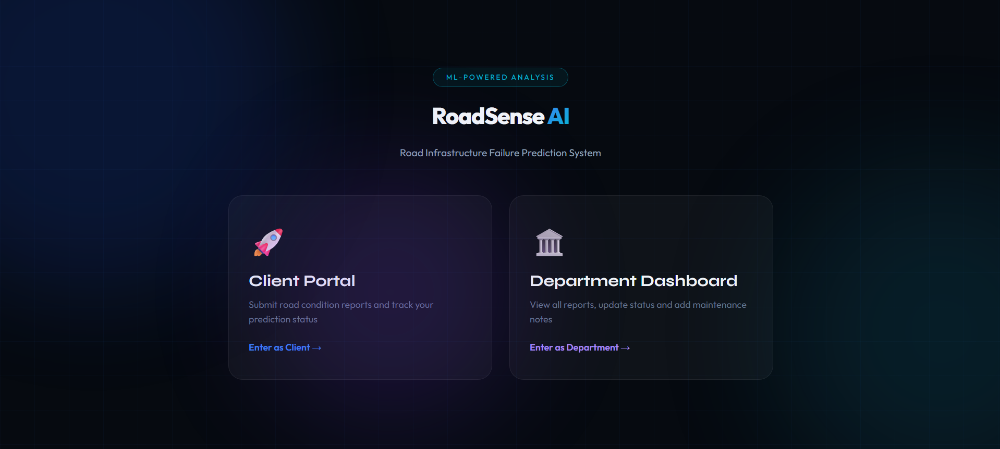
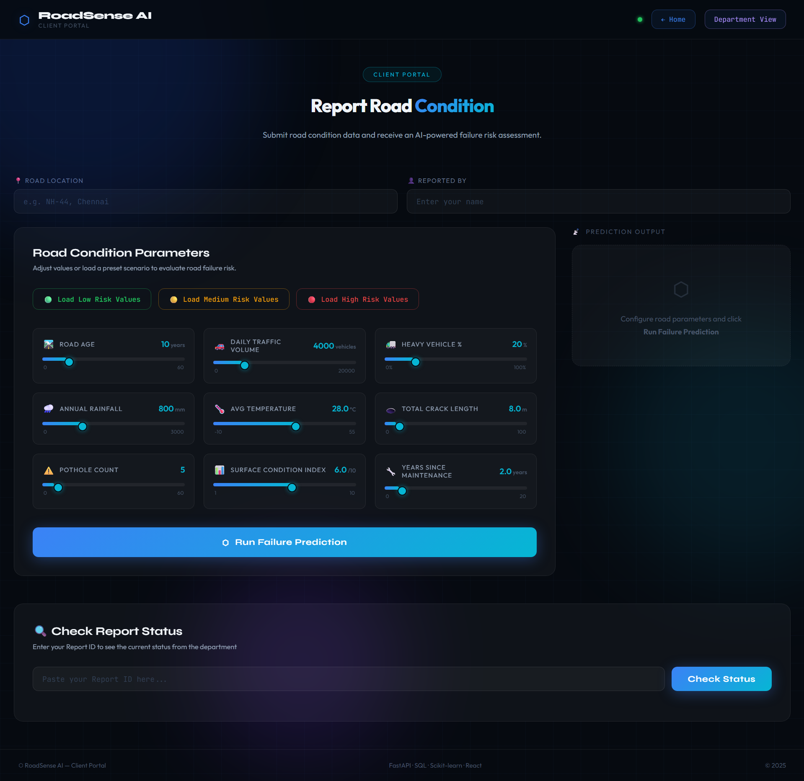
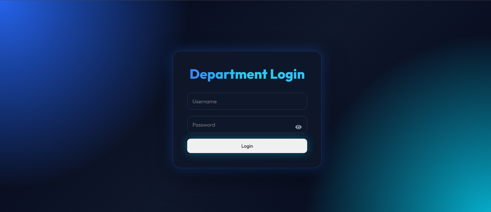
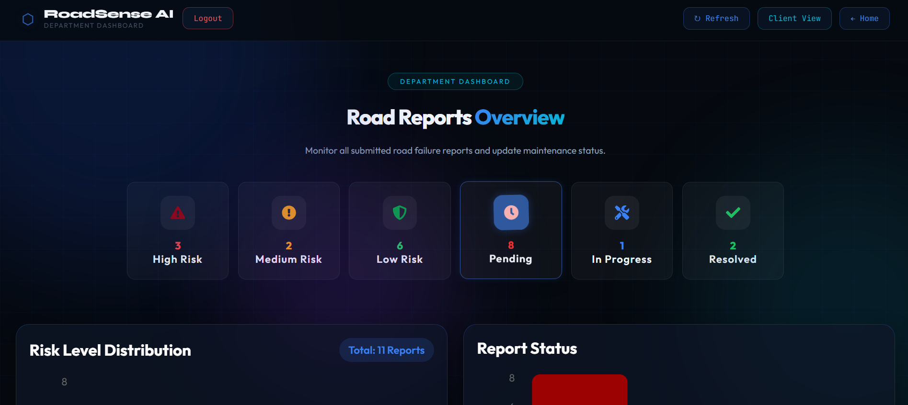
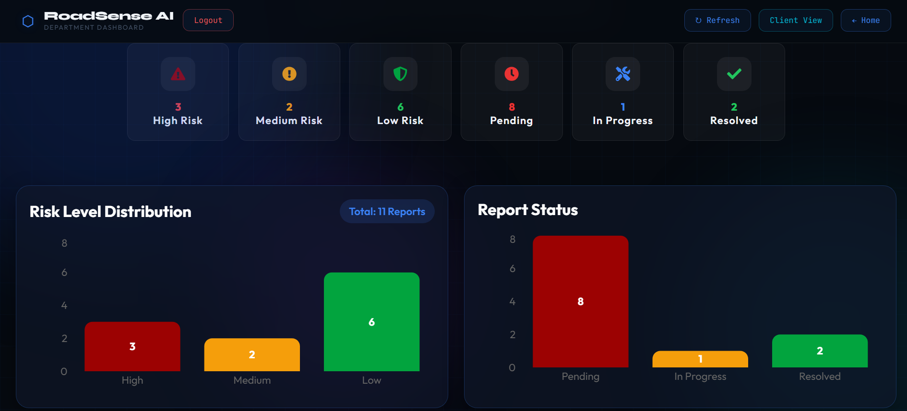
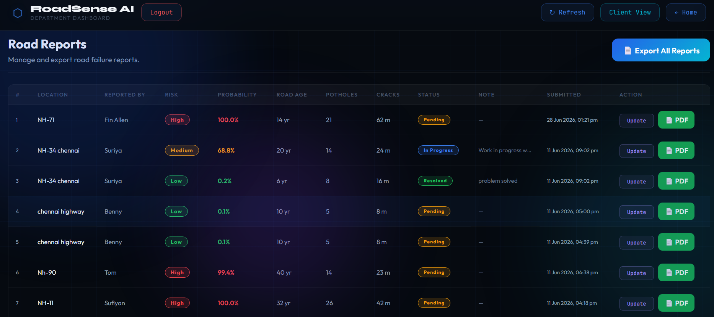
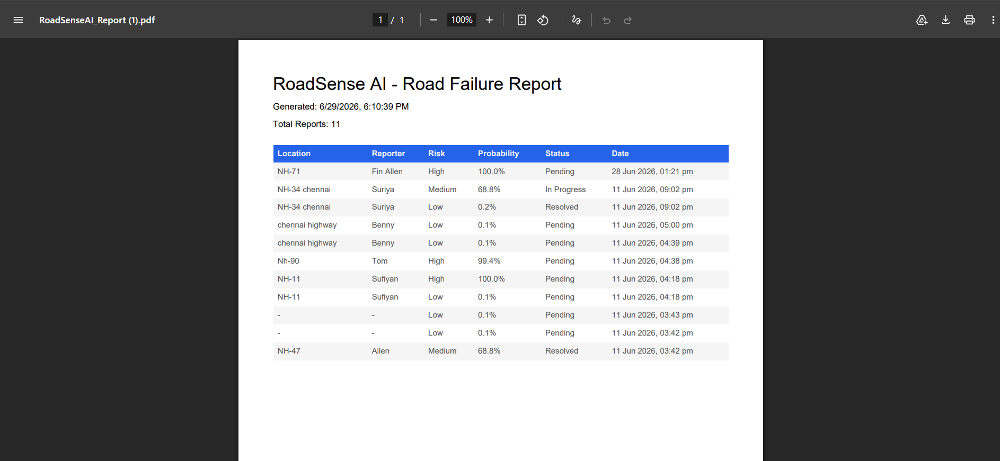

# 🛣️ RoadSense AI – Road Infrastructure Failure Prediction System

<p align="center">


</p>

An AI-powered web application that predicts road infrastructure failures such as **potholes**, **road cracks**, and **surface deterioration** using Machine Learning. The system enables citizens to report road issues while providing government departments with an interactive dashboard to monitor, verify, update, and manage road maintenance activities.

---

# 🎯 Project Objective

The objective of this project is to improve road maintenance by predicting infrastructure failures and providing a centralized platform for reporting, monitoring, and analyzing road conditions. By combining Machine Learning with a modern web application, the system helps authorities prioritize road repairs efficiently.

---

# ✨ Features

## 👤 Citizen Portal

* Submit road damage reports
* Enter road details (location, potholes, cracks, road age, etc.)
* AI-based road failure prediction
* View prediction probability and risk level
* Submit reports directly to the department

## 🏢 Department Dashboard

* Secure Department Login
* View all submitted reports
* Search reports by location or reporter
* Filter reports by Risk Level
* Filter reports by Status
* Update report status
* Add department notes
* Interactive dashboard with analytics
* Export all reports to PDF
* Export individual reports to PDF

## 📊 Dashboard Analytics

* Risk Level Distribution Chart
* Status Distribution Chart
* Statistics Cards
* Search & Filter System
* Professional Admin Dashboard UI

---

# 🛠️ Technologies Used

## Frontend

* React.js
* JavaScript
* HTML5
* CSS3
* Recharts
* React Router
* React Icons
* jsPDF

## Backend

* Python
* FastAPI
* SQLite
* Pydantic
* Uvicorn

## Machine Learning

* Scikit-learn
* Pandas
* NumPy
* Pickle

---

# 📁 Project Structure

```text
RoadSense-AI/
│
├── backend/
│   ├── data/
│   ├── models/
│   ├── database.py
│   ├── generate_dataset.py
│   ├── predict.py
│   ├── train_model.py
│   ├── main.py
│   ├── requirements.txt
│   └── road_prediction.db
│
├── frontend/
│   ├── public/
│   ├── src/
│   │   ├── components/
│   │   ├── pages/
│   │   ├── services/
│   │   ├── styles/
│   │   ├── App.js
│   │   └── index.js
│   ├── package.json
│   └── package-lock.json
│
├── .gitignore
└── README.md
```

---

# 🏗️ System Architecture

```text
Citizen
   │
   ▼
React Frontend
   │
   ▼
FastAPI Backend
   │
   ├────────► Machine Learning Model
   │
   └────────► SQLite Database
                    │
                    ▼
          Department Dashboard
```

---

# 🚀 Installation

## Clone the Repository

```bash
git clone https://github.com/sufiyanbuilds/AI-failure-prediction.git
```

## Backend Setup

```bash
cd backend

pip install -r requirements.txt

python -m uvicorn main:app --reload
```

Backend will run at:

```
http://127.0.0.1:8000
```

## Frontend Setup

```bash
cd frontend

npm install

npm start
```

Frontend will run at:

```
http://localhost:3000
```

---

# 📸 Screenshots


* Home Page

* Citizen Portal

* Login Page

* Department Dashboard

* Analytics Dashboard

* Reports

* PDF Export

---

# 📈 Future Enhancements

* GPS-based location detection
* Email/SMS notifications
* Mobile application
* Real-time road monitoring
* Cloud deployment
* User authentication with database

---

# 👨‍💻 Development Team

This project was developed collaboratively by:

| Team Member | Contribution |
|-------------|--------------|
| **Niyaz Ahmed** | Frontend Development, UI Design |
| **Mohammed Sufiyan** | Machine Learning, FastAPI Backend, Dashboard Features |
| **Thufeal Ahmed** | Database Integration, Testing, Documentation |

**Degree:** Bachelor of Engineering (Computer Science and Engineering)

**Academic Year:** 2025–2026

# 📄 License

This project was developed as a Final Year Engineering Project for educational and academic purposes. It is intended for learning, demonstration, and research.